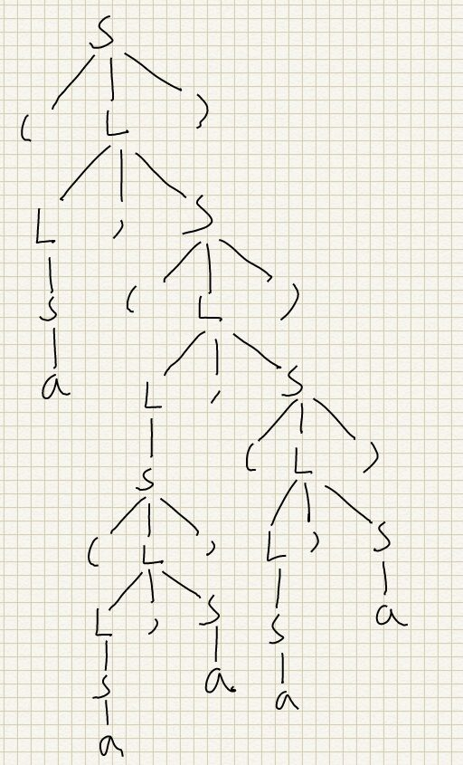

# 编译原理第三次作业

## 焦培淇  PB17151767

---
## 3.1（a）
(a,(a,a))

(a,((a,a)),((a,a)))

## 3.1（b）
(a,(a,a))

S &rArr; (L) &rArr; (L,S) &rArr; (S,S) &rArr; (a,S) &rArr; (a,(L)) &rArr; (a,(L,S)) &rArr; (a,(S,S)) &rArr; (a,(a,S)) &rArr; (a,(a,a))

(a,((a,a),(a,a)))

S &rArr; (L) &rArr; (L,S) &rArr; (S,S) &rArr; (a,S) &rArr; (a,(L)) &rArr; (a,(L,S)) &rArr; (a,(S,S)) &rArr; (a,((L),S)) &rArr; (a,((L,S),S)) &rArr; (a,((S,S),S)) &rArr; (a,((a,S),S)) &rArr; (a,((a,a),S)) &rArr; (a,((a,a),(L)))&rArr; (a,((a,a),(L,S))) &rArr; (a,((a,a),(S,S))) &rArr; (a,((a,a),(a,S))) &rArr; (a,((a,a),(a,a)))

## 3.6（b）
S &rarr; aSbS | bSaS | &epsilon;

该文法不是正规文法

## 3.6（c）
S &rarr; AaA | BbB 

A &rarr; aAbA | bAaA | aA | &epsilon;

B &rarr; aBbB | bBaB | bB | &epsilon;

该文法不是正规文法

## 3.8（a）
S &rarr; (L) | a

L &rarr; SL'

L' &rarr; ,SL' | &epsilon;

## 3.8（b）
	void match(terminal t)
	{
		if(lookahead==t)
			lookahead=nextToken();
		else
			error();
	}
	void S()
	{
		if(lookahead=='(')
		{
			match('(');
			L();
			match(')');
		}
		else if
		{
			match('a');
		}
		else
		{
			error();
		}
	}
	void L()
	{
		S();
		L'();
	}
	void L'()
	{
		if(lookahead==',')
		{
			match(',');
			S();
			L'();
		}
		else if
		{
			match('ε')
		}
		else
		{
			error();
		}
	}

## 3.10
首先计算FIRST和FOLLOW

FIRST(D)=FIRST(T)={int,real}

FIRST(L)={id}

FIRST(R)={',',&epsilon;}

FOLLOW(D)=FOLLOW(L)={$}

FOLLOW(T)={id}

FOLLOW(R)={$}

建立分析表如下：

| &nbsp; | int          | real          | id | , | $ |
| --- | --- | --- | --- | --- | --- |
| D | D &rarr; TL  | D &rarr; TL   |  &nbsp;  |     &nbsp;      | &nbsp;  |
| T | T &rarr; int | T &rarr; real | &nbsp;   |    &nbsp;       | &nbsp;  |
| L |  &nbsp;      | &nbsp;        | L &rarr; id R |&nbsp; | &nbsp; |
| R |  &nbsp;    |   &nbsp;     |  &nbsp;  | R &rarr; , id R | R &rarr; &epsilon; |

## 3.11
首先计算FIRST和FOLLOW

FIRST(S)={a,b,&epsilon;}

FIRST(A)={b,a}

FIRST(B)={a,b}

FOLLOW(S)={$}

FOLLOW(A)={a,b,$}

FOLLOW(B)={a,b,$}

建立分析表如下：

| &nbsp; | a            | b            | $                  |
| --- | --- | --- | --- | 
| S      | S &rarr; aBS | S &rarr; bAS | S &rarr; &epsilon; |
| A      | A &rarr; a   | A &rarr; bAA | &nbsp;             |
| B      | B &rarr; aBB | B &rarr; b   | &nbsp;             |

## 3.12
不是LL1文法，因为S &rarr; AB | PQx 而FIRST(AB)={x},FIRST(PQx)={d,a,x},FIRST(AB) &cap; FIRST(PQx) != &emptyset;

因此不是LL1文法
